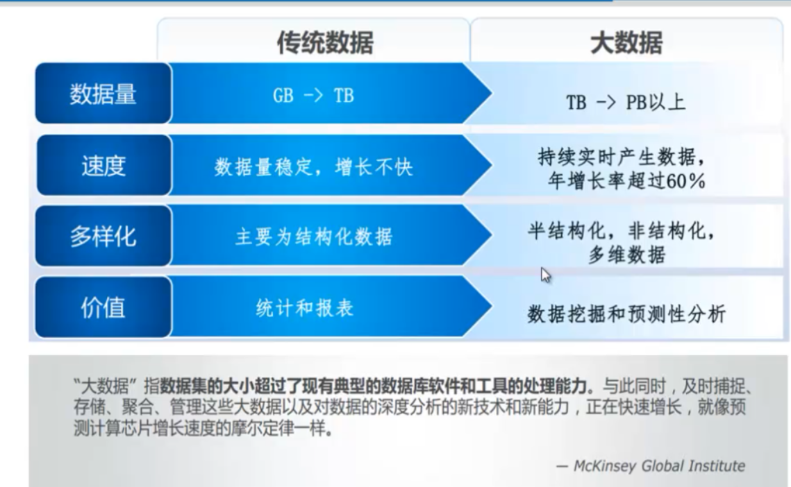
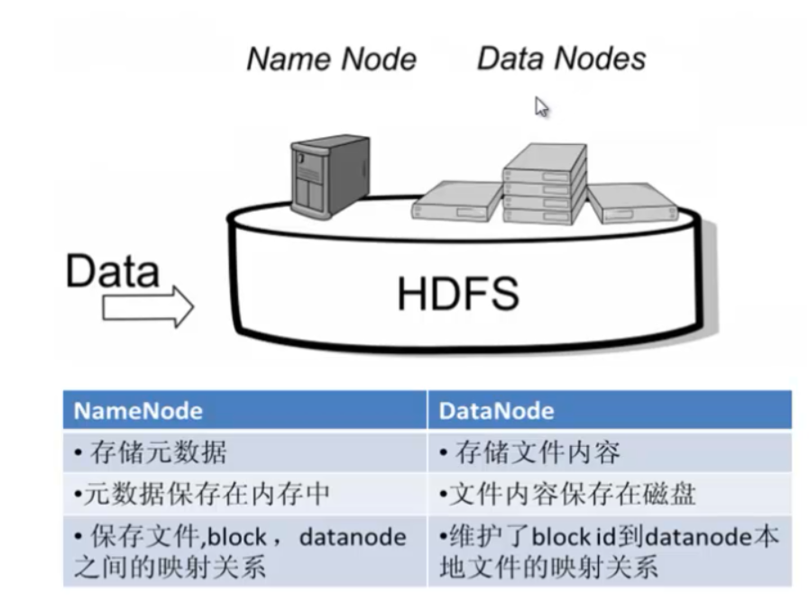
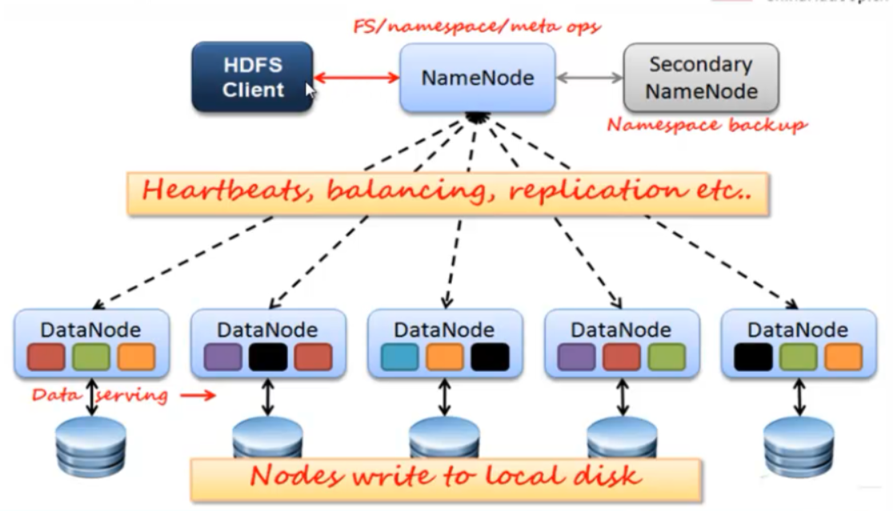
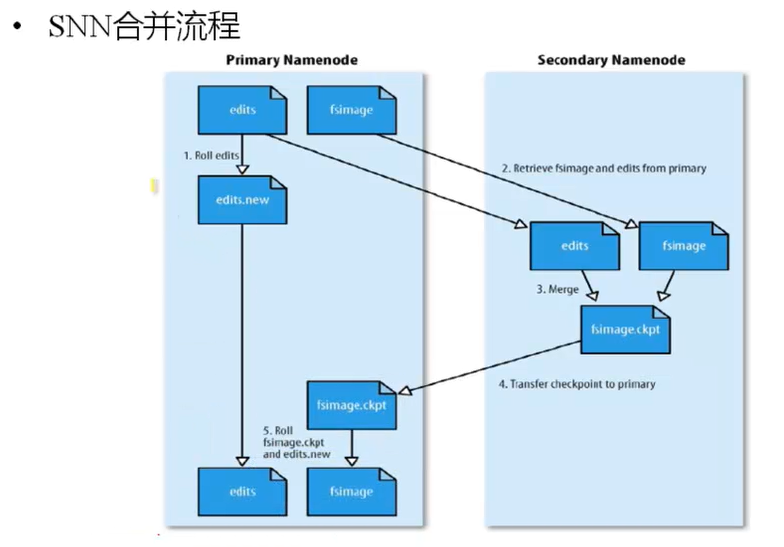
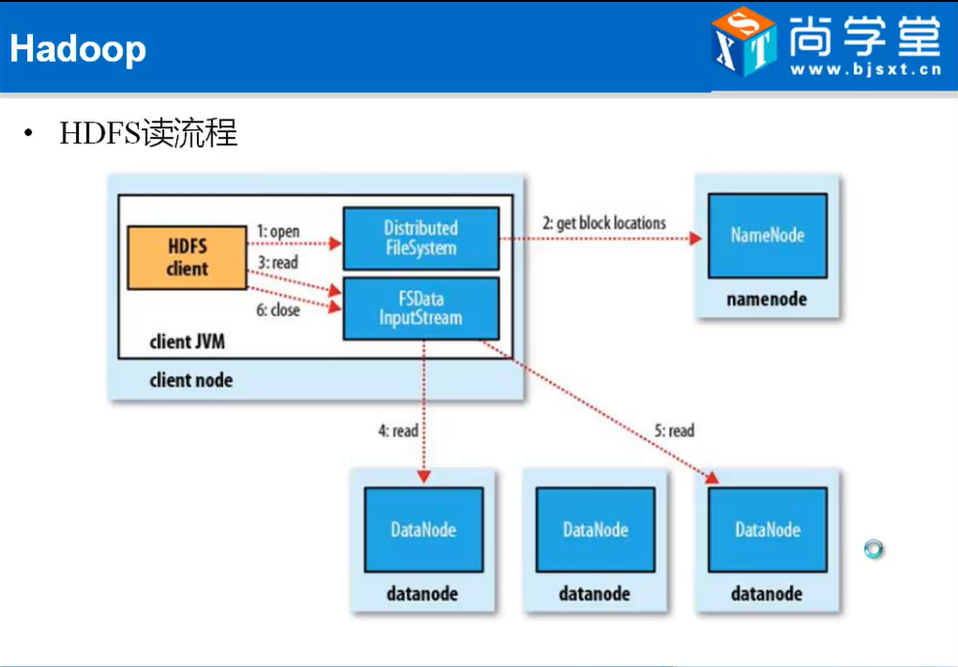
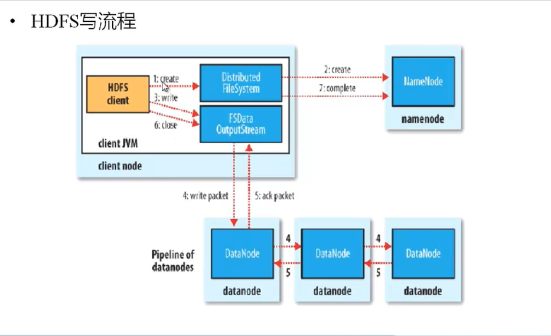

<!-- Hadoop来源：谷歌的三篇论文

大数据的解决方案：Hadoop

### Hadoop的两大核心

1. HDFS
2. MapReduce

### 大数据VS传统数据

结构化数据：可存入关系型的数据库中。

### 关系型数据VSHadoop

1. 并行关系数据库
2. MPP or Hadoop

### 谁在使用Hadoop?

阿里、百度、谷歌

### Hadoop版本问题

Hadoop1.2.1

### HDFS结构

### HDFS优点

1. 高容错性
2. 适合批量处理
3. 适合大数据处理
4. 可构建在廉价机器上

### HDFS缺点

1. 低延迟数据访问
2. 小文件存取
3. 并发写入、文件随机修改

### HDFS架构

1. NameNode负责任务的请求，NameNode把请求转发给各个DataNode
2. HDFS数据存储单元

- 文件被分为固定大小的数据块
- 一个文件的存储方式
- Block大小和副本数通过Client端上传文件时候设置

3. NameNode:接收客户端的读写服务
4. SecondaryNameNode（NN）:帮助NameNode合并edits文件，起到一定的热备份作用

- SNN合并流程
  

5. DataNode（DN）,存储数据

- Black的副本放置策略
  - 第一个副本
  - 第二个副本
  - 第三个副本
  - 更多副本：随机节点

### HDFS读流程

### HDFS写流程

1. HDFS文件权限
2. 安全模式：完成一个初始化的工作 -->