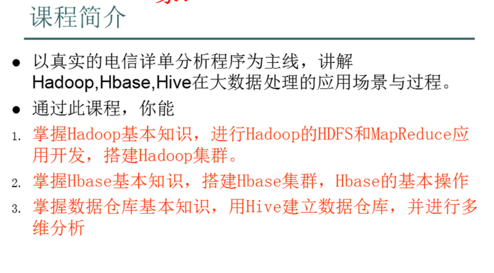
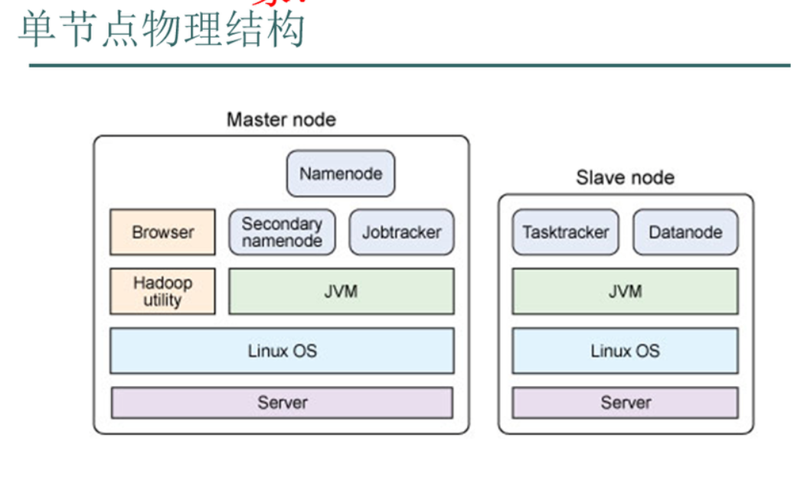
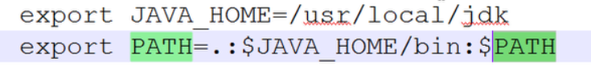
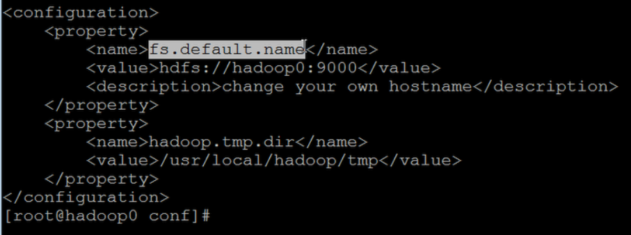
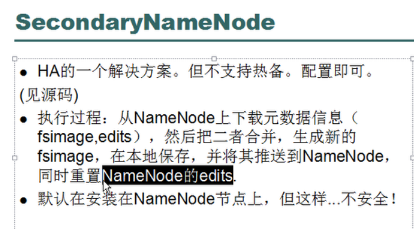
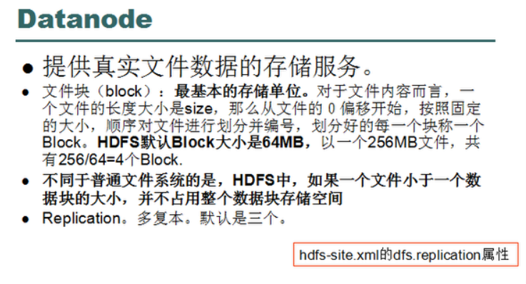
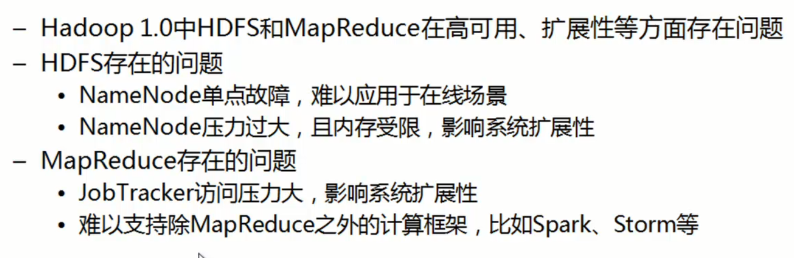

- 以原始的方式安装jdk软件

  - 配置环境变量：配置到/etc/environment文件

    ```
    JAVA_HOME="java的路径"
    PATH="/usr/local/sbin:/usr/local/bin:/usr/sbin:/usr/bin:/sbin:/bin:/usr/games:/usr/local/games:java的路径/bin"
    ```

  - 让该文件生效 

    - source environment

  - 打印java的

## Hadoop安装

- hadoop下载
- Hadoop安装
- 配置HADOOP_INSTALL和PATH环境变量
  - 不用设置HADOOP_HOME，后面不要带斜线


- 测试安装：hadoop version

Hadoop配置模式

- 独立模式
  - 没有运行的守护程序，所有程序运行在JVM中。适合开发期间运行MapReduce程序，源于它的易于测试和调试。
  - ./hadoop fs -ls / 该命令表示显示当前的目录
- 伪分布式
  - 守护进程运行在本机主机，模拟一个小规模的集群。
- 完全分布式
  - 守护进程运行在多个主机上的集群。
- 海量数据（存储、运算）
- jps查看java进程

3、centos7下临时分配IP地址（lo表示本地网卡）

- 使用命令：ifconfig

4、配置core-site.xml文件（core-default.html、hdfs-default.html）

- node1为namenode

5、配置hdfs-site.xml文件（hdfs-default.html）

- node2为datanode
- node3为datanode

6、配置slaves文件

7、配置slaves

- 配置secondnode
- 修改主机名（hostnamectl set-hostname <主机名>）
- 免密码登陆：在任何一台节点都可以启动其他的进程

8、做免密码登陆

- node1登陆到node2和node3

9、搭建mapreduce

10、在node1上配置mapred-site.xml文件，配置node1为主

11、通过命令：./hadoop fs -ls /查看hdfs中的内容

问题总结：

1、namenode启动以后一会，其他的节点自动关闭了

- 原因是没关防火墙

## Hadoop安装

- hadoop下载
- Hadoop安装
- 配置HADOOP_INSTALL和PATH环境变量
  - 不用设置HADOOP_HOME，后面不要带斜线


- 测试安装：hadoop version

Hadoop配置模式

- 独立模式
  - 没有运行的守护程序，所有程序运行在JVM中。适合开发期间运行MapReduce程序，源于它的易于测试和调试。
  - ./hadoop fs -ls / 该命令表示显示当前的目录
- 伪分布式
  - 守护进程运行在本机主机，模拟一个小规模的集群。
- 完全分布式
  - 守护进程运行在多个主机上的集群。
  - 修改虚拟主机的名称以及存放位置
    - 修改名称
    - 修改目录
    - 修改虚拟机配置文件
- 海量数据（存储、运算）
- jps查看java进程
- 查看自己是那个用户：whoami，在/etc目录下的passwd文件中修改
- 查看主机名：hostname ，在/etc目录下的hosts文件里面修改
- 通过符号链接动态修改配置：ln-s 文件夹 符号链接

## 传智播客资料

- hadoop与javaee不冲突



- 命令行环境
- java环境
- Hadoop项目简介
- 搭建Hadoop的伪分布式环境
- Hadoop的生态圈：框架
- HDFS类似于windows的资源管理器，用来存储文件的
- 结构化的数据存放到关系型数据库中，非结构化的数据，比如日志信息等等
- Hbase在线事务处理应用，比如淘宝的在线订单系统，其为hadoop的数据库
- 监控管理系统，比如监控内存，cpu利用率等等
- 数据流
- 工作流
- Hadoop是适合大数据的分布式存储与计算平台（受谷歌三篇论文的启发）
- Apache基金会
- HDFS：分布式文件系统
- MapReduce:并行计算框架

## HDFS架构

- 主从结构
  - 主节点：只有一个，namenode


- 从节点：有很多个，datanode
- namenode负责
  - 接收用户操作请求
  - 维护文件系统的目录结构
  - 管理文件与black之间的关系，black与datanode之间关系
- datanode负责
  - 存储文件


- 文件被分成black存储在磁盘上


- 为保证数据安全，文件会有多个副本
- 减小文件的损失

## MapReduce的架构

- 主从结构
  - 主节点：只有一个，JobTracker


- 从节点：有很多个，TaskTracker
- JobTracker与TaskTracker之间的关系如同项目经理与开发人员的关系
- JobTracker负责（管理）
  - 接收客户提交的计算任务
  - 把计算任务分给TaskTracker执行


- 监控TaskTracker的执行情况
- TaskTracker负责（执行）
  - 执行JobTracker分配的计算任务

## Hadoop的特点

- 扩展能力
- 成本低
- 高效率：并行处理
- 可靠性：hadoop能够自动维护数据的副本
- 跨java虚拟机之间的通信
- 交换机



## Hadoop部署方式

- 本地模式
- 伪分布模式：在一台机器上模拟多台机器
- 集群模式

## 伪分布模式安装步骤

- 关闭防火墙
- 修改ip
- 修改hostname
- 设置ssh自动登陆
- 安装jdk
- 安装hadoop

## linux基本命令

## hadoop的伪分布式安装步骤

- 设置静态IP，设置完成后执行网卡重启命令service network restart即可，并执行ifconfig查看是否设置ok。
- 修改主机名的目的（类似于域名）
  - 使用hostname why设置，该设置只是临时生效


- 修改/etc/hosts文件
- 还可以vi /etc/sysconfig/network文件
- 域名解析，一个IP绑定一个域名
- 将主机名与IP绑定到一起，修改/etc/hosts文件，增加一行192.168.181.132 node，重启并作验证。
- 关闭防火墙（防止端口的使用），使用命令service iptables status无效，执行service iptables stop也无效，执行chkconfig --list有显示，执行chkconfig iptables off无效，设置后需要做验证。

## SSH

- 执行命令：ssh-keygen -t rsa就会产生公钥和私钥了，其都放在~/.ssh文件夹下。
  - 执行命令` cat ~/.ssh/id_dsa.pub >> ~/.ssh/authorized_keys	 ` 


- 验证：ssh localhost

## 安装jdk

- 使用.bin文件安装，注意该文件需要可执行的权限
- /etc/profile配置环境变量，最后执行source /etc/profile



## 安装Hadoop

- 使用tar -zxvf 命令解压该文件
- 设置hadoop的环境变量，类似于配置jdk的步骤


- 修改hadoop的配置文件，位于/hadoop下的conf文件夹中
- 修改四个文件hadoop-env.sh（修改java的环境变量），core-site.xml，hdfs-site.xml，mapred-site.xml
- 对hadoop进行格式化，执行命令./hadoop namenode -format
- 执行./start-all.sh
- jps查看java进程
- 验证：执行命令jps，将看到几个java进程或者通过浏览器的方式来验证，若能看到，则说明namenode这个进程是活的，还能说明namenode这个进程还是一个web服务器。同理，jobtracker也是一个web服务器。
- 通过浏览器访问：http://192.168.181.132:50030和http://192.168.181.132:50070
- 通过主机名的方式访问，需要修改宿主机的hosts文件即可。
- 出错原因：


- 多次格式化hadoop也是错误的？
  - 方法：删除/opt/hadoop1.2/tmp文件夹，重新格式化一遍

## 分布式文件系统

对用户来说，像是访问本地的文件系统一样。

- 对HDFS的操作方式：hadoop fs xxx


- hadoop fs -ls / 查看根目录


- mkdir
- ./hadoop fs -lsr / 以递归的形式显示根目录下的内容，注意目录是没有副本的，文件大小
- .hadoop fs -mkdir /test1在hdfs根目录下创建test1目录
- ./hadoop fs -put ~/anaconda-ks.cfg /test1 文件上传命令，注意若目的目录不存在，则目的目录变为一个文件名称了，把数据从linux上传到hdfs的特定路径中。
- ./hadoop fs -get /test1/anaconda-ks.cfg . 从hdfs下载文件到本地（linux），其的后面的两个路径刚好相反。
- ./hadoop fs -text /test1/anaconda-ks.cfg查看hdfs中的文件。
- ./hadoop fs -rm /test1/anaconda-ks.cfg删除hdfs中的文件。
- ./hadoop fs -rmr /test1/anaconda-ks.cfg删除hdfs中的非空文件夹。
- 完整的路径为./hadoop fs -ls hdfs://node1:9000/



## namedata

- 维护元数据的信息，文件的信息，接受用户的请求。其在运行的时候将这些元数据加载 到内存中
- namenode的核心内容都存放到/opt/hadoop1.2/dfs/name/current下的fsimage中
- secondarynamenode的作用



## datanode



- linux中的块、windows中的文件系统读写磁盘的基本单位为簇。
- mysql用来管理数据的。
- 副本的概念，保证数据的安全性。
- 使用java来操作hdfs

## Hadoop2.0产生背景



云的概念

大数据

云存储

NO-SQL

数据的时代

## Hadoop2.x

- 解决问题

  - 海量数据的存储（HDFS）


  - 海量数据的分析（MapReduce，分析的模型，成为reduce程序）spark、storm


  - 资源管理调度（YARN）


- hadoop是由多个技术架构构成的，分布式运行，分布式计算


- hadoop擅长海量的离线数据分析

- hadoop怎么解决海量数据的存储？

- hadoop版本选择和伪分布式安装

- 关闭图形界面，使用命令init 3即可，并修改其配置文件（/etc/inittab文件）

- 让普通用户具备sudo执行权限，在/etc/sudoers文件中加入

  ```
  root    ALL=(ALL)       ALL
  hadoop  ALL=(ALL)       ALL
  ```

- 修改主机名/etc/sysconfig/network，设置hostname node1，设置立即生效，使用exit退出

- 设置域名解析

- 安装jdk

- 使用alt+p快捷键，执行put 路径

- 配置java环境变量，/etc/profile针对所有的用户都生效，最后执行source /etc/profile

- 配置各个配置文件

- 关闭防火墙

- HDFS的实现思想：

  1、通过分布式集群来存储文件，为客户端提供了便捷的虚拟目录树

  2、文件存储到hdfs集群中去的时候是被切分成block的

  3、文件的block存放在若干台dataname节点

  4、hds文件系统的文件于真实的block之间由映射关系，由namenode管理

  5、每个block在集群中会存储多个副本，可以提高数据的可靠性，提高并发能力

- HDFS的shell操作，不支持修改

- ssh免密码登陆

- 由namenode负责副本的分配

- 若文件为一个个的小文件，则会浪费空间，mapreduce效率也会降低

- 元数据存储到namenode的内存中

- namenode如何管理元数据，加入一个edits log文件

1、客户端上传文件时，NN首先往edits log文件中记录元数据操作日志

2、客户端开始上传文件，完成后返回成功信息给NN，NN就在内存中写入这次上传操作新产生的元数据信息

3、每当edits log写满时，需要将这段时间新的元数据刷新到fsimage文件中去

4、NN通知SN进行checkpoint操作

5、datanode提供真实文件数据的存储服务。

6、startx直接在控制台下运行界面即可

7、添加相应的依赖包

- namenode的职责：维护元数据信息
- 维护hdfs的目录树

8、RPC即为两个进制之间的调用，远程过程调用，节点之间的通信是靠RPC机制来实现的，进程之间的远程调用

9、datanode定期向namenode汇报自己的情况

10、RPC机制主要利用动态站点和反射的机制

## Mapduce框架、运算框架（运算模型）

map:数据简单的处理工作（局部处理）

reduce:数据汇总（全局处理）

- mapreduce可以运行在本地，但在windows下可能会因为兼容性的问题而出错，但在linux下不会出问题。
- hadoop jar命令是将jar包和其他的一些附加信息提交到集群中去的。
- mapreduce的运作机制
- YARN框架是用来做资源调度的
- MRAppMaster进程用来管理MapReduce框架的

1、mr程序的几种提交运行模式

- 本地模式运行
- 集群模式运行（直接使用hadoop的命令即可）

2、mapreduce框架的全貌

- inputformat负责文件的切片
- 其中inputformat是一个接口

3、zookeeper，是一个分布式的协调服务，提供少量数据的存储和管理，把数据的同步处理。

- 高可用性
- 提供分布式锁服务，
- 启动zookeeper，使用命令./zkServer.sh start启动即可。
- 查看该进程命令为：netstat -nltp | grep 2181
- 查看该进程的状态./zkServer.sh status
- ./zkCli.sh表示本地登录到zookeeper集群中去
- zookeeper管理客户所存放的数据采用的是类似于文件树的结构
- 每一个节点叫做一个node
- ls / 查看根节点
- create /node1 1000 表示创建一个子节点，并向其中写入数字1000
- get /node1获取该节点下的内容
- set /node1 1005修改该节点下的内容
- 杀死一个进程kill -9 2355
- zookeeper至少要有两个节点才可以，死了一个，不影响其他的数据
- 有两种类型，短暂的和持久的
- HA架构：设置了两个NN节点，但是同一个时刻只能有一个NN在对外提供服务。
- 两个NN必须保持元数据的一致性。
- qjiurnal用于管理edits文件，其依赖于zookeeper实现的。
- zkfc用于管理NN并监控NN。
- 每两个NN构成一个Federation(联邦)
- 使用7台机器
- 1 namenode zkfc
- 2 namenode zkfc
- 3 resourcemanager
- 4 resourcemanager
- 5 zookeeper journalnode datanode nodemanageer
- 6 5 zookeeper journalnode datanode nodemanageer
- 7 6 5 zookeeper journalnode datanode nodemanageer
- 启动第二个resourcemanager，yarn-daemon.sh start resourcemanager
- HA机制的hadoop
- 启动第二个namenode,
- 手动切换namenode的状态


- main方法详解
- main方法是由jvm调用的
- Hive:海量数据的查询与管理（类似于数据库），可以不需要懂java，只需要懂sql即可。
- Hive的工作原理：把sql语言转换成mapreduce程序。
- 注意：hive不是集群，其不支持一条一条的操作数据，不能插入数据。
- 建立文件与表之间的映射关系。
- hbase是一个基于hdfs的数据库，属于nosql数据库，一个巨大的表，有上亿条数据
- hbase表的结构。hbase的寻址机制。
- 在node3上配置hbase