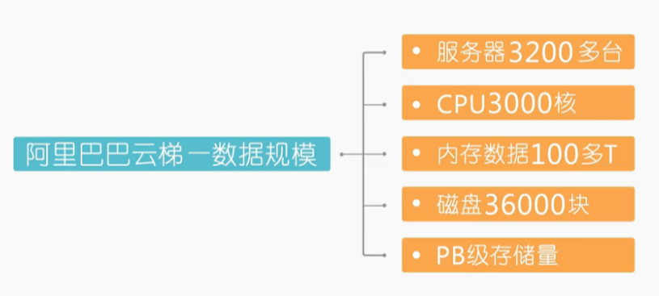
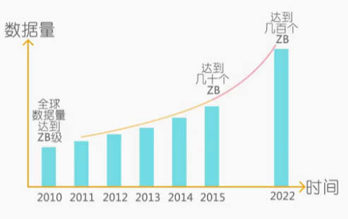
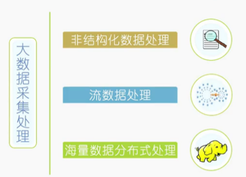
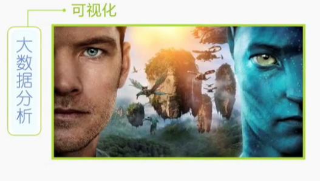

### 为什么要研究大数据？

1. 商业模式的驱动
2. 能力向消费者转移
3. 数据剧增

### UGC时代的到来

### 全新的计算时代

1. 传统的业务模式：IT落后于业务
2. DAAS模式：IT超前于业务

### 大数据的介绍

1. 数据量度

   

2. 社会描述

### 大数据的存在

1. 大数据有三类

- 商业数据（2%）
- 人为数据（8%）
- 机器数据（90%）

### 谁拥有大数据

电子商务公司

### 大数据在哪里？

谷歌机房中心

#### 大数据量化宇宙

1. 不断量化的宇宙

- 技术采集
- 数据维度
- 能量

2. 数据驱动

### 大数据目前处于初级阶段

### 数据成为资产

1. 数据资产评估维度
2. 信息社会的发展

- 目录
- 搜索
- 分享
- 推荐

### 企业内部管理的变革

### 社会目前处于的阶段

1. 消费者主权时代
2. 消费者自媒体时代
3. 信息大爆炸时代

### 大数据产业相关企业

1. 基础设施
2. 分析
3. 应用

### 大数据是一种方法

1. 大数据涉及的关键技术

- 大数据采集处理

  

- 大数据分析

- 存储、组织、管理

### 大数据的价值

1. 建立智慧，沟通的协作模型
2. 构建新的IT系统DAAS

### 大数据的核心技术

1. 分析技术

- 自然语言处理
- 大数据挖掘
  - 数据挖掘的算法：依赖于场景，能深度自学习

1. 存储技术

- [ ] 传统数据库
- [ ] 结构化数据
- [ ] 大数据的存储技术：数据流+临时数据+新数据

1. 采集技术

- [ ] 点多，方法多
- [ ] 传统数据（关系）----->大数据（流动的，原始数据，杂乱的数据）

#### 消除大数据认识的误区

- 大数据不等于hadoop
- 大数据不等于社交媒体数据（互联网数据等等）
- 大数据不等于技术（大数据包含技术和思维）
- 大数据不等于分析（大数据可能还跟分析、存储、计算有关系）
- 大数据不等于一种解决方案

