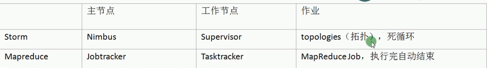
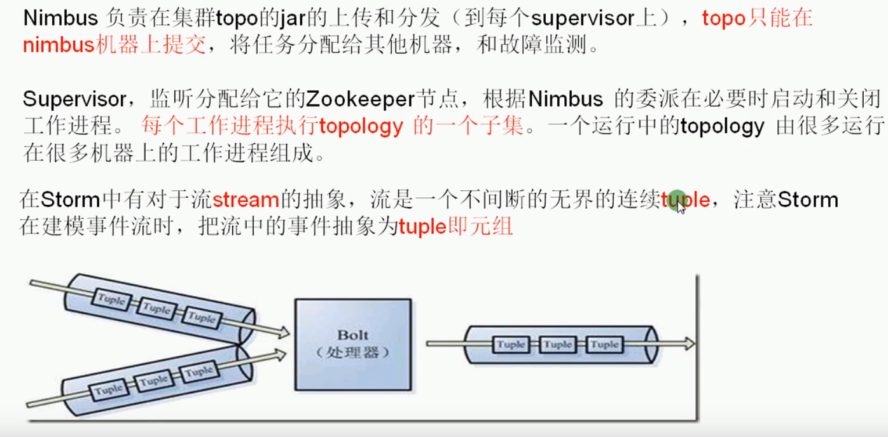
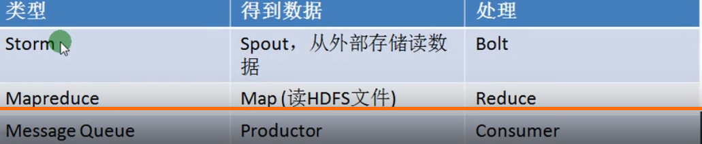

storm:
1、数据源：kafka，消息队列
2、hbase
3、highcharts
4、java:linux
5、服务器

实时版hadoop:storm，需要考虑线程安全问题
1、信息流处理，如聚合、分析等。
2、持续计算，如实时数据统计、监控。
3、storm的计算延迟是毫秒级，流计算，逐行或逐批次计算，按行数处理。
4、jstorm是storm的增强版

storm的一些关键性：
1、适用场合广泛：实时处理消息和更新DB
2、可伸缩性高
3、保证无数据丢失

storm架构原理：
1、无耦合
2、流可以理解为元祖
3、spout对应于map
4、storm将流中元素抽象为tuple
5、bolts:消息处理者

storm架构：
1、Toplogies:拓扑
1、spout组件从外部获取数据（消息队列、数据库、网络等），只有一个级别。
2、bolts:消息处理者
3、消息tuple
4、不同的消息走的路径就叫做流。
5、Tasks ： 任务处理单元
6、Executor :工作线程
7、Workers ：工作进程

storm集群：
1、一个storm集群里面有2种角色，一个是Nimbus，一个是Supervisor
2、Nimbus负责协调管理，Supervisor负责具体的运算

启动storm
1、在nimbus主机上

在前台启动：./storm nimbus
nohup ./storm nimbus 1>/dev/null 2>&1 &
nohup ./storm ui 1>/dev/null 2>&1 & web监控界面  node5:8080

2、在supervisor主机上
nohup ./storm supervisor 1>/dev/null 2>&1 &

storm程序：
1、spout负责获取数据和将数据发送给下个组件
2、toplogies提交到集群中去。

