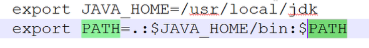

## Ubuntu 16.04下Samba相关配置:
- http://www.linuxidc.com/Linux/2016-12/138498.htm
- 注意：
  - 在完成上面教程的操作后，记得执行`sudo smbpasswd -a share`为该用户设置一个密码
  - 如果执行`sudo useradd share -u 6000 -s /shin/nologin -d /dev/null`,则执行`useradd share -u 6000 -g 6000 -s /sbin/nologin -d /dev/null`就行

## Ubuntu下SSH安装或设置:
- http://www.linuxidc.com/Linux/2013-07/87368.htm

## Ubuntu下Git的安装与使用:
- http://www.linuxidc.com/Linux/2016-09/135527.htm

## Ubuntu 16.04安装QQ国际版图文详细教程
- http://www.linuxidc.com/Linux/2016-09/134923.htm

##  Ubuntu 16.04 安装网易云音乐 
- http://blog.csdn.net/seekn/article/details/54599999
- 注意：在更换源的时候记得覆盖其中的内容

## Ubuntu 16.04下安装64位谷歌Chrome浏览器
- http://www.linuxidc.com/Linux/2016-05/131096.htm

## Ubuntu 16.04安装和配置Sublime Text 3 
- http://blog.csdn.net/frank_wangjianliang/article/details/51226807
- 注意：
  - 其中的3、安装SulimeClang 插件部分可以不用看
  - 插件的配置可以参考`http://www.cnblogs.com/unflynaomi/archive/2016/07/25/5704293.html`中的安装 Anaconda （蟒蛇）python插件部分

## ubuntu16.04安装pycharm
- http://blog.csdn.net/apple9005/article/details/52900335
- http://www.cnblogs.com/seamount/archive/2017/08/10/7340452.html
- 注意：在该教程中直接参考"安装pycharm.sh"部分即可

## ubuntu16.04安装ngnix
- http://www.cnblogs.com/piscesLoveCc/p/5794926.html

## ubuntu16.04安装virtualenv 
- http://blog.csdn.net/wxyangid/article/details/53308865(为python3创建虚拟环境)
- http://blog.csdn.net/kongxx/article/details/51858153(为python2创建虚拟环境)

## Ubuntu 16.04安装Markdown编辑器MarkMyWords
- http://www.cnblogs.com/EasonJim/p/7243033.html

## Ubuntu16.04安装PostgreSQL并使用pgadmin3管理数据库_图文详解 
- http://blog.csdn.net/caib1109/article/details/51582663

## 使用u盘安装ubunt 16.04系统教程
- http://www.linuxidc.com/Linux/2016-04/130520.htm

## 安装搜狗输入法
- http://pinyin.sogou.com/linux/
- http://blog.csdn.net/ljheee/article/details/52966456

## 如何Python写一个安卓APP 
- http://blog.csdn.net/heivy/article/details/50585118

## Nginx+Django+Uwsgi架构部署
- http://www.linuxidc.com/Linux/2014-09/106928.htm
- http://blog.aizhet.com/Linux/12608.html

## Ubuntu 16.04下安装MySQL
- http://www.linuxidc.com/Linux/2017-06/144805.htm

## ubuntu安装EnvironmentError: mysql_config not found错误
- http://blog.csdn.net/ping523/article/details/54289398


## Ubuntu软件包桌面程序以及增强工具

- apt：高级打包工具


- 软件仓库，软件源改为163的

```
1、修改/etc/apt目录下的sources.list文件，在网络上搜索163软件源，并复制到该文件中（记得做备份操作）
2、更新源
sudo apt-get update
3、升级软件
sudo apt-get upgrade
```

- 桌面安装


```
1、查找桌面
sudo apt-cache search ubuntu-desktop
2、并选择相应的桌面安装
sudo apt-install ubuntu-desktop
3、sudo apt-get purge xxx 彻底删除软件包
```

- 以原始的方式安装jdk软件

  - 配置环境变量：配置到/etc/environment文件

    ```
    JAVA_HOME="java的路径"
    PATH="/usr/local/sbin:/usr/local/bin:/usr/sbin:/usr/bin:/sbin:/bin:/usr/games:/usr/local/games:java的路径/bin"
    ```
   - 让该文件生效 
     - source environment
   - 打印java的

## Hadoop安装

- hadoop下载
- Hadoop安装
- 配置HADOOP_INSTALL和PATH环境变量

  - 不用设置HADOOP_HOME，后面不要带斜线


- 测试安装：hadoop version

Hadoop配置模式

- 独立模式
  - 没有运行的守护程序，所有程序运行在JVM中。适合开发期间运行MapReduce程序，源于它的易于测试和调试。
  - ./hadoop fs -ls / 该命令表示显示当前的目录
- 伪分布式
  - 守护进程运行在本机主机，模拟一个小规模的集群。
- 完全分布式
  - 守护进程运行在多个主机上的集群。
  - 修改虚拟主机的名称以及存放位置
    - 修改名称
    - 修改目录
    - 修改虚拟机配置文件
- 海量数据（存储、运算）
- jps查看java进程
- 查看自己是那个用户：whoami，在/etc目录下的passwd文件中修改
- 查看主机名：hostname ，在/etc目录下的hosts文件里面修改
- 通过符号链接动态修改配置：ln-s 文件夹 符号链接

## 传智播客资料

- hadoop与javaee不冲突


- 命令行环境
- java环境
- Hadoop项目简介
- 搭建Hadoop的伪分布式环境
- Hadoop的生态圈：框架
- HDFS类似于windows的资源管理器，用来存储文件的
- 结构化的数据存放到关系型数据库中，非结构化的数据，比如日志信息等等
- Hbase在线事务处理应用，比如淘宝的在线订单系统，其为hadoop的数据库
- 监控管理系统，比如监控内存，cpu利用率等等
- 数据流
- 工作流
- Hadoop是适合大数据的分布式存储与计算平台（受谷歌三篇论文的启发）
- Apache基金会
- HDFS：分布式文件系统
- MapReduce:并行计算框架

## HDFS架构

- 主从结构

  - 主节点：只有一个，namenode


  - 从节点：有很多个，datanode

- namenode负责

  - 接收用户操作请求
  - 维护文件系统的目录结构

  - 管理文件与black之间的关系，black与datanode之间关系

- datanode负责

  - 存储文件


  - 文件被分成black存储在磁盘上


  - 为保证数据安全，文件会有多个副本
  - 减小文件的损失

## MapReduce的架构

- 主从结构

  - 主节点：只有一个，JobTracker


  - 从节点：有很多个，TaskTracker

- JobTracker与TaskTracker之间的关系如同项目经理与开发人员的关系

- JobTracker负责（管理）

  - 接收客户提交的计算任务
  - 把计算任务分给TaskTracker执行


  - 监控TaskTracker的执行情况

- TaskTracker负责（执行）

  - 执行JobTracker分配的计算任务

## Hadoop的特点

- 扩展能力
- 成本低
- 高效率：并行处理
- 可靠性：hadoop能够自动维护数据的副本
- 跨java虚拟机之间的通信
- 交换机


## Hadoop部署方式

- 本地模式
- 伪分布模式：在一台机器上模拟多台机器
- 集群模式

## 伪分布模式安装步骤

- 关闭防火墙
- 修改ip
- 修改hostname
- 设置ssh自动登陆
- 安装jdk
- 安装hadoop

## linux基本命令

## hadoop的伪分布式安装步骤

- 设置静态IP，设置完成后执行网卡重启命令service network restart即可，并执行ifconfig查看是否设置ok。

- 修改主机名的目的（类似于域名）

  - 使用hostname why设置，该设置只是临时生效


  - 修改/etc/hosts文件
  - 还可以vi /etc/sysconfig/network文件
  - 域名解析，一个IP绑定一个域名
  - 将主机名与IP绑定到一起，修改/etc/hosts文件，增加一行192.168.181.132 node，重启并作验证。
  - 关闭防火墙（防止端口的使用），使用命令service iptables status无效，执行service iptables stop也无效，执行chkconfig --list有显示，执行chkconfig iptables off无效，设置后需要做验证。

## SSH

- 执行命令：ssh-keygen -t rsa就会产生公钥和私钥了，其都放在~/.ssh文件夹下。
  - 执行命令` cat ~/.ssh/id_dsa.pub >> ~/.ssh/authorized_keys	 ` 


- 验证：ssh localhost

## 安装jdk

- 使用.bin文件安装，注意该文件需要可执行的权限
- /etc/profile配置环境变量，最后执行source /etc/profile



## 安装Hadoop

- 使用tar -zxvf 命令解压该文件
- 设置hadoop的环境变量，类似于配置jdk的步骤


- 修改hadoop的配置文件，位于/hadoop下的conf文件夹中
- 修改四个文件hadoop-env.sh（修改java的环境变量），core-site.xml，hdfs-site.xml，mapred-site.xml
- 对hadoop进行格式化，执行命令./hadoop namenode -format
- 执行./start-all.sh
- jps查看java进程
- 验证：执行命令jps，将看到几个java进程或者通过浏览器的方式来验证，若能看到，则说明namenode这个进程是活的，还能说明namenode这个进程还是一个web服务器。同理，jobtracker也是一个web服务器。
- 通过浏览器访问：http://192.168.181.132:50030和http://192.168.181.132:50070
- 通过主机名的方式访问，需要修改宿主机的hosts文件即可。
- 出错原因：


- 多次格式化hadoop也是错误的？
  - 方法：删除/opt/hadoop1.2/tmp文件夹，重新格式化一遍

## 分布式文件系统

对用户来说，像是访问本地的文件系统一样。

- 对HDFS的操作方式：hadoop fs xxx


- hadoop fs -ls / 查看根目录


- mkdir
- ./hadoop fs -lsr / 以递归的形式显示根目录下的内容，注意目录是没有副本的，文件大小
- .hadoop fs -mkdir /test1在hdfs根目录下创建test1目录
- ./hadoop fs -put ~/anaconda-ks.cfg /test1 文件上传命令，注意若目的目录不存在，则目的目录变为一个文件名称了，把数据从linux上传到hdfs的特定路径中。
- ./hadoop fs -get /test1/anaconda-ks.cfg . 从hdfs下载文件到本地（linux），其的后面的两个路径刚好相反。
- ./hadoop fs -text /test1/anaconda-ks.cfg查看hdfs中的文件。
- ./hadoop fs -rm /test1/anaconda-ks.cfg删除hdfs中的文件。
- ./hadoop fs -rmr /test1/anaconda-ks.cfg删除hdfs中的非空文件夹。
- 完整的路径为./hadoop fs -ls hdfs://node1:9000/


## namedata

- 维护元数据的信息，文件的信息，接受用户的请求。其在运行的时候将这些元数据加载 到内存中
- namenode的核心内容都存放到/opt/hadoop1.2/dfs/name/current下的fsimage中
- secondarynamenode的作用


## datanode


- linux中的块、windows中的文件系统读写磁盘的基本单位为簇。
- mysql用来管理数据的。
- 副本的概念，保证数据的安全性。
- 使用java来操作hdfs